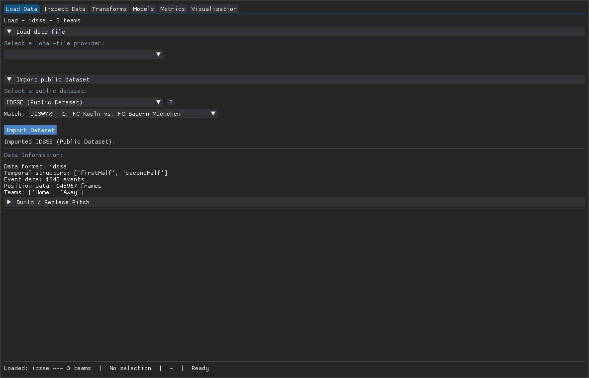

# floodlight-gui

[](https://pypi.org/project/floodlight-gui/) [](https://pypi.org/project/floodlight-gui/) [](LICENSE) [](https://github.com/floodlight-sports/floodlight)

A desktop application for loading, inspecting, transforming, modeling, and visualizing sports tracking and event data, with no scripting required.


## About

floodlight-gui is a [Dear PyGui](https://github.com/hoffstadt/DearPyGui) frontend for [floodlight](https://github.com/floodlight-sports/floodlight), a data-driven sports analytics framework for tracking and event data. It exposes floodlight's parser, transforms, models, metrics, and plotting through a six-tab interface (Load, Inspect, Transforms, Model, Metrics, Visualization).

Everything the GUI shows comes straight from floodlight, so the analytics stay faithful to the library. If you prefer to script directly, head to the [floodlight repository](https://github.com/floodlight-sports/floodlight).

## Features

-   **10+ data providers**: DFL / STS, Tracab / ChyronHego, Kinexon, Opta, Second Spectrum, SkillCorner, Sportradar, StatsPerform, and StatsBomb, plus two bundled public datasets (EIGD-H handball, IDSSE football) that download on demand.
-   **9 models**: Velocity, Acceleration, Distance, Centroid, Nearest Mate, Nearest Opponent, Convex Hull, Metabolic Power, and Discrete Voronoi, with live Convex Hull and Voronoi overlays on the pitch.
-   **3 metrics**: Approximate Entropy, Zone Aggregation, and Formation Similarity.
-   **Transform suite** across five categories (filter, interpolation, spatial, temporal, permutation) with an apply / undo / reset operation stack.
-   **Interactive pitch visualization** with playback, keyboard shortcuts, and a GPU-accelerated drawlist that holds 60+ FPS on typical playback.
-   **Export**: single frames as PNG / SVG / PDF, model and metric results as CSV, and optional MP4 clips.
-   **In-app help**: a `?` button beside every model, transform, metric, and provider opens the upstream floodlight documentation.

## Install

### From PyPI (Python 3.10 to 3.13)

```         
pip install floodlight-gui
floodlight-gui
```

For MP4 clip export, add the optional `video` extra, which bundles ffmpeg:

```         
pip install "floodlight-gui[video]"
```

### Standalone executable (no Python required)

Download the build for your operating system from the [Releases page](https://github.com/spoho-datascience/floodlight-gui/releases), unzip it, and run the `floodlight-gui` executable inside.

The binaries are currently unsigned, so on first launch:

-   **Windows**: click "More info", then "Run anyway".
-   **macOS**: right-click the app and choose "Open" (once).

## Quickstart: IDSSE football

A five-step interactive session against the bundled IDSSE football dataset (no manual file paths required).

### 1. Load a match



Open the **Load** tab, pick **IDSSE (Public Dataset)** as the provider, and choose a match from the combo. The loader downloads and caches the dataset, then unifies it into floodlight's `XY` / `Events` / `Teamsheet` / `Pitch` objects.

### 2. Visualize positions on the pitch


Switch to the **Visualization** tab. Players render as labeled circles on a live pitch. Use the period selector and the playhead to scrub through frames.

### 3. Fit a Convex Hull model


In the **Model** tab, pick **Convex Hull**, click **Fit Model**, and toggle its overlay on. The team hull polygon appears on the pitch, expanding and contracting as players move.

### 4. Layer a Voronoi tessellation


Repeat the flow with **Discrete Voronoi**: fit, toggle, and return to the visualization tab. The cells render per player, colored by team, at interactive framerates.

### 5. Open per-descriptor help


Every descriptor has a `?` button beside it. Clicking it opens a modal with the upstream floodlight documentation (summary, parameters, examples, and a link to the online docs).

## Guides

Task-oriented walkthroughs live in [`docs/`](docs/):

-   [Loading data](docs/loading-data.md): file providers, the bundled public datasets, and building or replacing a pitch.
-   [Transforming tracking data](docs/transforms.md): filtering, interpolation, and the apply / undo / reset op stack.
-   [Fitting models and exporting results](docs/models-and-export.md): single and multi-team models, reading outputs, and CSV export.
-   [Visualization and export](docs/visualization.md): playback, model overlays, and exporting frames and clips.

For the meaning of any individual model, transform, or metric, click its `?` button in the app. The analytics theory lives in the [floodlight documentation](https://floodlight.readthedocs.io).

## Contributing

Contributions are welcome. See [CONTRIBUTING.md](CONTRIBUTING.md) for the local development workflow and how to add a new provider, model, transform, or metric by writing a single descriptor.

## Citation

If you use floodlight-gui in research, please cite the underlying library:

> Raabe, D., et al. (2022). floodlight: A high-level, data-driven sports analytics framework. arXiv:2206.02562.

## License

Released under the MIT License. See [LICENSE](LICENSE).