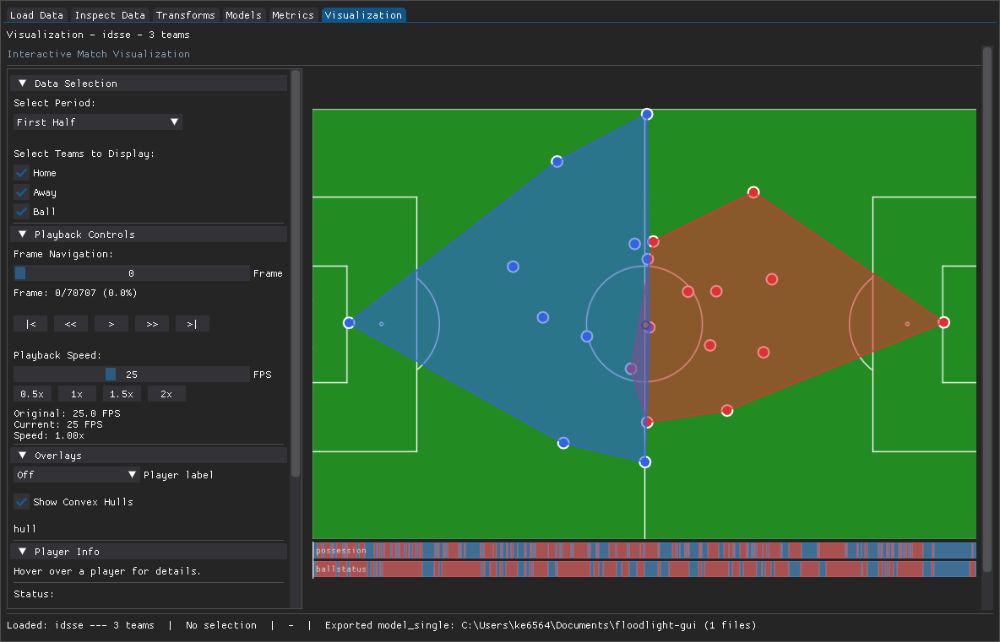
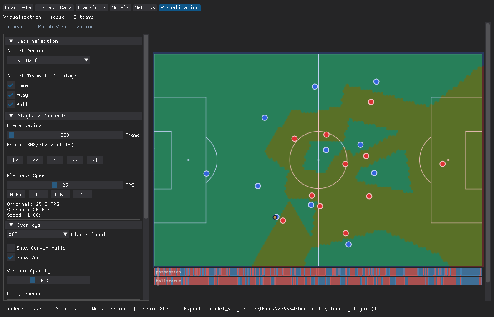

# Fitting models and exporting results

The **Model** tab fits floodlight's models to the loaded data, and the
**Metrics** tab computes summary metrics. Both produce results you can read in
the GUI and export to CSV.

## Fitting a model

Nine models are available, grouped by family in a category tab bar: Velocity,
Acceleration, Distance, Centroid, Nearest Mate, Nearest Opponent, Convex Hull,
Metabolic Power, and Discrete Voronoi.

1. Open the **Model** tab and pick a model.
2. Choose the period and team. Most models fit a single team. Two models need
   two teams: **Nearest Opponent** and **Discrete Voronoi**. For those, pick a
   distinct team in each team slot.
3. Select the players to include and the outputs you want, then set any
   parameters (each has a `?` button for the floodlight documentation).
4. Click **Fit**.

The results panel shows the fitted outputs, organised by period and team. A
model's outputs are also available to the Metrics tab as inputs.

## Live overlays

Convex Hull and Discrete Voronoi can render live on the pitch. After fitting,
open the **Visualization** tab and toggle the overlay on. See
[Visualization and export](visualization.md) for details.

## Computing a metric

The **Metrics** tab follows the same shape. Three metrics are available:
Approximate Entropy, Zone Aggregation, and Formation Similarity. A metric takes
either an `XY` input or the output of a fitted model.

1. Open the **Metrics** tab and choose the period and team scope.
2. Pick a metric and configure its inputs and parameters. Metrics that consume a
   model output let you pick from the outputs you have already fitted.
3. Click **Compute**. Selecting the "All" scope computes every period and team
   (or every fitted leaf) in one pass.

## Exporting to CSV

Both tabs expose an export action below the results. It writes one CSV per
result leaf (a single result writes one file). The default output folder is a
`floodlight-gui` folder under your Documents directory; use the folder picker to
change it. Re-exporting the same selection overwrites the previous file.

## Next steps

- [Visualization and export](visualization.md)
