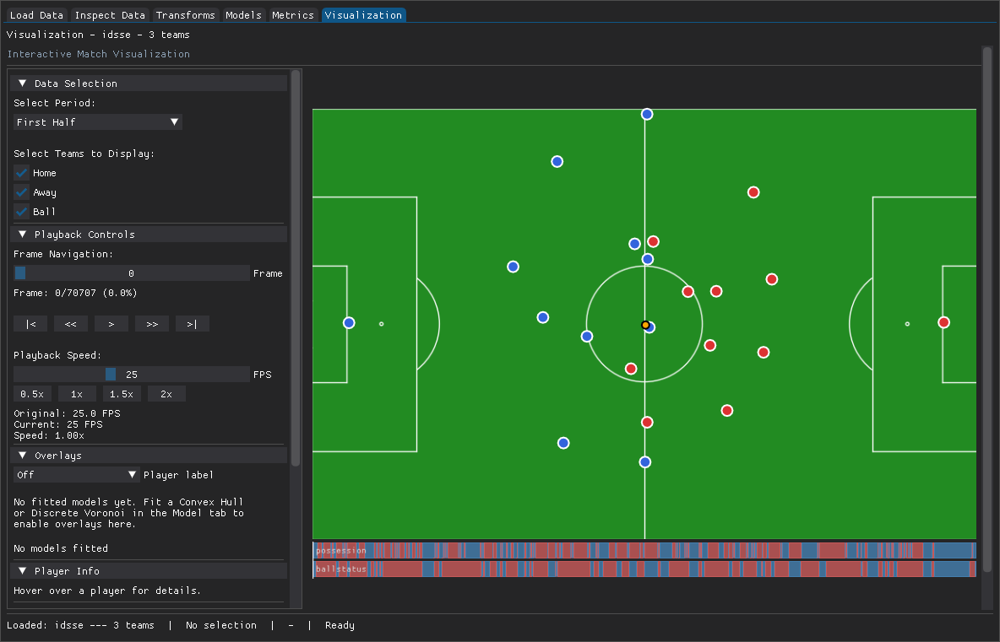
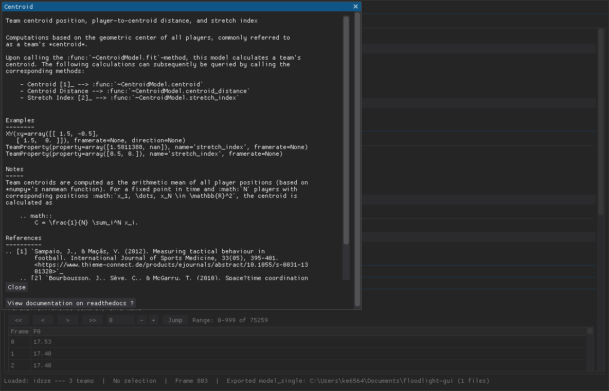

# Visualization and export

The **Visualization** tab draws the loaded match on a live pitch and plays it
back. Players render as circles with jersey labels on a GPU-accelerated Dear
PyGui drawlist, at 60+ FPS on typical playback.

## Playback

- Use the period selector to choose a half or segment.
- Press play to animate, and drag the playhead to scrub to any frame.
- Adjust the speed control to play faster or slower than real time.

Keyboard shortcuts work whenever the Visualization tab is active:

- **Space**: play / pause
- **Left / Right arrows**: step one frame back / forward
- **Home / End**: jump to the start / end of the current period

## Model overlays

Convex Hull and Discrete Voronoi models can be drawn on top of the players:

1. Fit the model in the **Model** tab (see
   [Fitting models and exporting results](models-and-export.md)).
2. Return to the **Visualization** tab and toggle the overlay on.

The overlay updates live as playback advances.

## Exporting frames and clips

The export panels write the current view to disk:

- **Image**: the current frame as PNG, SVG, or PDF.
- **Video**: a short clip as MP4. Clip export requires `ffmpeg`; install it with
  the optional extra (`pip install floodlight-gui[video]`). When `ffmpeg` is not
  available the video button is disabled and labelled accordingly.

Both panels share a filename field and a folder picker. The default output
folder is a `floodlight-gui` folder under your Documents directory. Leaving the
filename blank uses an auto-generated name based on the frame numbers.

## Per-descriptor help

Across the Model, Transforms, Metrics, and Load tabs, every model, transform,
metric, and provider has a `?` button. It opens a modal with that item's
upstream floodlight documentation: summary, parameters, examples, references,
and a link to the floodlight ReadTheDocs page.

